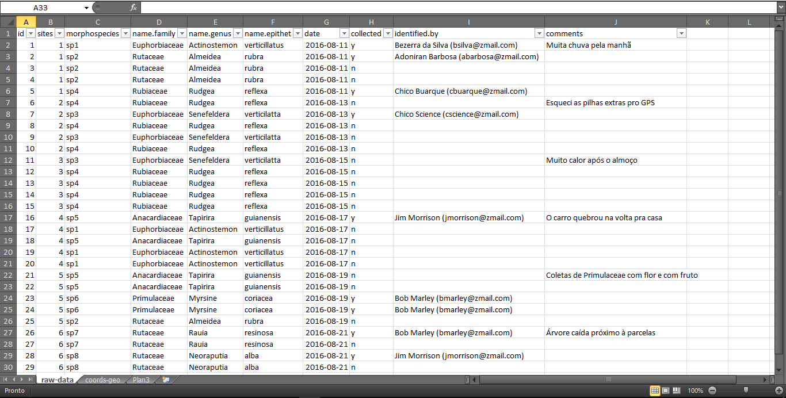
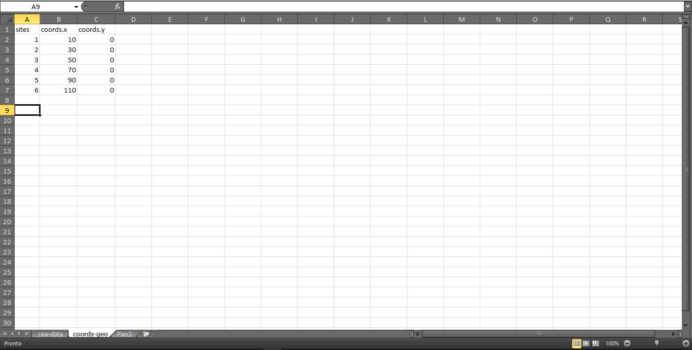

```{r setup, include=FALSE}
knitr::opts_chunk$set(echo = TRUE)
```

<!-- http://stackoverflow.com/questions/28894515/rmarkdown-directing-output-file-into-a-directory -->

```{r write quant output files, include = FALSE}
out_dir <- 'reports'
if(!file.exists(out_dir)) {
  dir.create(out_dir)
}
```

## Pacotes necessários


```{r, message = FALSE}
source("functions/ipak.R")
ipak(packages <- c("readxl", "reshape2", "magrittr", "flora",
                   "data.table", "ape", "phytools", "brranching",
                   "picante", "xlsx"))
```


## Entrada dos dados


+ Usando o pacote `readxl` para ler os dados direto de uma planilha do Excel (nota¹: um arquivo '.csv' aceita controle de versão e, além disso, não é uma extensão proprietária);


+ A planilha tem os registros brutos (eu entraria com os dados de campo dessa forma);


+ A planilha do Excel pode ainda conter colunas com as datas e os comentários dos dias de coleta. A função `read_excel` completará as células vazias com `NA`.


+ Reservei a coluna `morphospecies` para os apelidos que darei às espécies no início das coletas;





```{r}
raw.df <- read_excel("data/raw-data.xlsx", sheet = 1, col_names = TRUE)
str(raw.df) # estrutura da matriz e os tipos de variáveis contidas
```


## Limpando e transformando os dados


+ **Os passos a seguir são opcionais**:


+ Serão incluídas duas novas colunas à matriz original;


+ A primeira terá as *strings* em `name.genus` e `name.epithet` concatenadas;


+ A segunda terá as *strings* em `name.genus` e `name.epithet` concatenadas formando um código;


+ É claro que esses passos dependem de uma planilha do Excel **impecável**! 


```{r}
new.df <-
  subset(
    raw.df, 
    select = c(
      "sites", 
      "morphospecies", 
      "name.genus", 
      "name.epithet"
      )
    )
  
# new.df$name.merged <-  # 'name.merged' será uma nova coluna
#   with(new.df,         # em 'new.df', contendo a 
#        paste0(         # concatenação das strings em
#          name.genus,   # 'name.genus' 
#          ".",          # mais um ponto (".") e 
#          name.epithet  # name.epithet
#          )
#        ) 

new.df$name.coded <-          # 'name.coded' será uma nova coluna 
  with(new.df,                # em 'new.df', contendo a
       paste0(                # concatenação das strings 
         substr(              # que tiveram as letras extraídas
           name.genus, 1, 3   # 'name.genus' (da primeira à terceira letra)
           ),                 # mais 
         ".",                 # um ponto (".") e
         substr(              # 
           name.epithet, 1, 3 # 'name.epithet' (da primeira à terceira letra)
           )
         )
       )
       

str(new.df)
```


## Tabela dinâmica com a função `ftable` do pacote `stats`


+ Os *pipes* (`%>%`) mantêm uma cadeia de comandos.


+ Pode-se usar tanto `morphospecies` quanto `name.coded` nos comandos a seguir:


### Gerando a matriz de comunidades com `morphospecies` nas colunas


```{r}
df1 <- ftable(morphospecies ~ sites, new.df) %>% # mantém df1 para a próxima função
  as.matrix(.) %>% # o ponto se refere à df1
  as.data.frame(.) # o ponto se refere à df1
df1
```


### Gerando a matriz de comunidades com `name.coded` nas colunas 


+ Repare que a ordem alfabética das colunas é mantida!


```{r}
df2 <- ftable(name.coded ~ sites, new.df) %>% # mantém df2 para a próxima função
  as.matrix(.) %>% # o ponto se refere à df2
  as.data.frame(.) # o ponto se refere à df2
df2      # chamando a matriz no console
```

+ Mas eu prefiro *rankear* a matriz das mais abundantes para as menos abundantes.


```{r}
df3 <- df2[order(colSums(df2), decreasing = TRUE)]
df3
```


## Rápida exploração


+ Criando mapas de distribuuição das abundâncias.





```{r}
xy <- read_excel("data/raw-data.xlsx", sheet = 2, col_names = TRUE) %>%
  .[,-1]

for (i in colnames(df3)) {
  plot(
  xy,
  cex = df3[, i],
  pch = 22,
  col = "white",
  bg = "gray"
  )
  title(names(df3[i]))
  }
  
```


<!-- ## Tabela dinâmica com a função `dcast` do pacote `reshape2` -->

<!-- xy <- -->
<!--   dcast(raw.df, -->
<!--         sites + coords.y + coords.x ~ coords.y) %>% -->
<!--         subset(., select = c("coords.x", "coords.y")) -->


## Obtendo informações da Lista da [Flora do Brasil](http://reflora.jbrj.gov.br/reflora/listaBrasil/ConsultaPublicaUC/ConsultaPublicaUC.do#CondicaoTaxonCP)


```{r}
raw.dt <- as.data.table(raw.df)

names.aggregated <-
  raw.dt[, list(.N), by = c("name.family", 
                            "name.genus", 
                            "name.epithet")]

names.aggregated

query.flora <- paste0(names.aggregated$name.genus,
                      " ", 
                      names.aggregated$name.epithet)

query.flora

names.flora.2020 <-
  get.taxa(
    query.flora,
    replace.synonyms = TRUE,
    suggest.names = TRUE,
    life.form = TRUE,
    habitat = TRUE,
    vernacular = TRUE,
    states = TRUE,
    establishment = TRUE,
    suggestion.distance = 1
  )
```


## Organizando dados para análise filogenética


```{r}
phylomatic.names <- 
  tolower(paste(names.aggregated$name.family,
                names.aggregated$name.genus,
                paste(names.aggregated$name.genus, 
                      names.aggregated$name.epithet,
                      sep = "_"),
                sep = "/"))

phylomatic.names


get.tree.phylomatic <-
  phylomatic(
    phylomatic.names,
    taxnames = FALSE,
    informat = "newick",
    method = "phylomatic",
    storedtree = "R20120829",
    outformat = "newick",
    clean = FALSE, # influência no plot
    db = "apg",
    verbose = TRUE
  )

```


### Árvore filogenética não datada


```{r}
# se o 'clean = TRUE', use a função plot direto. 
# plot(get.tree.phylomatic)
plot(collapse.singles(get.tree.phylomatic), no.margin=TRUE)

```


```{r}
###############################################################################
################### PHYLOCOM WORKFLOW #########################################
###############################################################################

# Uma pequena adaptação baseada em: 
# https://greggilbertlab.sites.ucsc.edu/wp-content/uploads/sites/276/2015/10/R_Class10b_PicatePhylomatic.pdf

# temp <- tempfile()
# download.file("http://phylodiversity.net/phylocom/phylocom-4.2.zip", temp, mode = "wb")
# unzip(temp)

# setwd("phylocom-4.2/w32")
# getwd()
# 
# write.tree(get.tree.phylomatic, "tree-phylomatic")
#
# file.rename(from = "../example_data/bladj_example/wikstrom.ages",
#            to = "ages")
# 
# dated.tree <- system("phylocom bladj -f tree-phylomatic > dated-tree",
#                      intern = TRUE)
# 
# write(dated.tree, "dated-tree")
# 
# dated.clean <- scan("dated-tree", what = "character", nmax = -1, sep = "]")
# 
# dated.clean <-
#   sub(pattern = ")euphyllophyte:1.000000",
#       replacement = "",
#       x = dated.clean)
# 
# dated.clean <- sub(pattern = "\\(",
#                    replacement = "",
#                    x = dated.clean)
# 
# dated.clean <- gsub(pattern = " ",
#                     replacement = "",
#                     x = dated.clean)
# 
# dated.clean <- read.newick(text = dated.clean)
# 
# setwd("../../")
# getwd()
# 
# write.tree(dated.clean, "data/dated.clean.txt")

dated.clean <- read.newick(file = "data/dated.clean.txt")

# dated.clean$edge
# dated.clean$tip.label
# dated.clean$Nnode
# dated.clean$node.label
```


### Árvore filogenética datada


```{r}
plot(collapse.singles(dated.clean), no.margin=TRUE)
add.scale.bar(length = 100)
 
# plot.phylo(collapse.singles(dated.clean), type = "phylogram", use.edge.length = TRUE, show.tip.label = TRUE, show.node.label = TRUE, edge.color = "grey10")
# nodelabels()
# tiplabels()
# 
# cophenetic.phylo(collapse.singles(dated.clean))
```


## Organizando dados para análise funcional


Pensar em um worflow para a manipulação dos dados brutos direto no excel, levando em conta a variação intra-específica.


Preparar output (matriz) para as análises.

```{r}
# O comando abaixo criará uma planilha do Excel com os nomes 
# das espécies agregados.
# MUITO CUIDADO COM O USO DESSA FUNÇÃO!
# ELA SOBRESCREVE QUALQUER ARQUIVO!
# DEVE SER UTILIZADA, IDEALMENTE, QUANDO TODOS
# OS NOMES DAS ESPÉCIE ESTIVEREM DISPONÍVEIS.

# write.xlsx(names.aggregated,
#            "data/[somente-visualizacao]trait-data.xlsx", 
#            sheetName = "spp-list")

```

